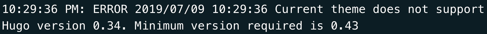
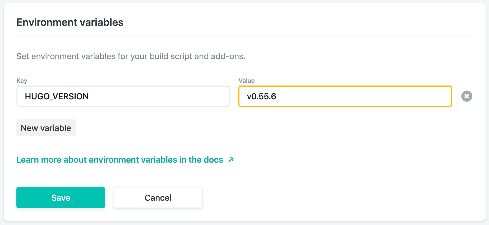

For my last blog post, the usual push to `master` wasn't deploying my site to [Netlify](https://www.netlify.com/).

My first port of call was to take a look at the build logs in `Netlify` itself.

Aha! Let's have a look at the logs. This line looks interesting.

Looks like we're somehow using an older version of [Hugo](https://gohugo.io/) than our theme supports.

Let's have a look at the environment variables

Looks like we set it to `0.34` when we first set up the site. Let's update it to the latest version.

Now let's trigger a new deploy.

It worked!

